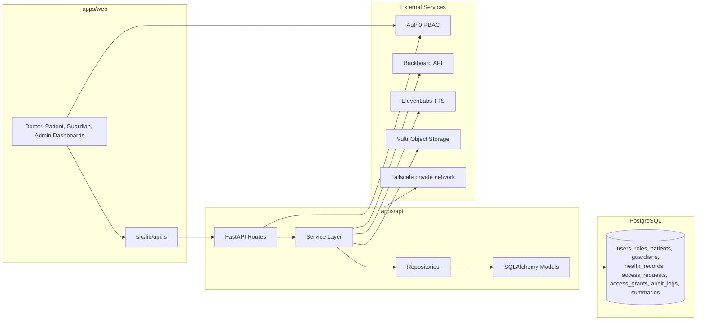

# HealthConnect - Final Monorepo Demo Guide

HealthConnect is a patient-controlled consent and access layer for healthcare records in the Canadian ecosystem.
It does not replace hospital EHR systems. It controls who can access which record categories, for how long, and captures full audit history.

## Hackathon Submission Snapshot

### Fun Project Description

HealthConnect is the privacy-focused "permission switchboard" for healthcare.
Instead of copying patient data into a new mega-database, we sit between patients and fragmented systems so people can say:
"Yes, this doctor can see my labs and meds for 24 hours," or "No, not that file."

The MVP combines consent workflows, AI-generated explanations, and read-aloud accessibility so patients and guardians can understand what they are approving, while providers get fast, scoped access and a full audit trail.

### Public Code Repository

- GitHub: `https://github.com/<your-org-or-username>/healthconnect`
- Replace with your real public repo URL before submission.

### Tools, Libraries, and Hardware Used

#### Frontend

- Vite
- React (JSX)
- Tailwind CSS
- Framer Motion
- Recharts
- Lucide React
- Auth0 React SDK

#### Backend

- Python 3
- FastAPI
- Pydantic
- SQLAlchemy
- Psycopg
- PostgreSQL
- HTTPX
- Boto3 (S3-compatible storage client)

#### AI, Accessibility, and Cloud

- Backboard (AI orchestration/provider integration)
- ElevenLabs (text-to-speech)
- Vultr Compute
- Vultr Object Storage
- Tailscale private networking

#### Dev and Infra

- Docker
- Docker Compose
- npm / Node.js
- pytest
- ESLint

#### Hardware / Devices Used

- Developer laptops (Windows + macOS)
- Vultr cloud VM (backend hosting)
- Speakers/headphones for TTS validation
- Smartphone browser for mobile UI and QR/accessibility checks

### Sponsor Category Tags (If Applicable)

- `Auth0`
- `Vultr`
- `Tailscale`
- `Backboard`
- `ElevenLabs`
- `Healthcare`
- `AI`
- `Accessibility`
- `Privacy`
- `Security`
## What This Build Includes

- Frontend: Vite + React + Tailwind + Auth0 + dashboard UX
- Backend: FastAPI + Pydantic + SQLAlchemy + PostgreSQL
- Providers:
  - AI: MockProvider and BackboardProvider
  - TTS: MockTTSProvider and ElevenLabsProvider
  - Storage: LocalStorageProvider and VultrObjectStorageProvider
- Networking model: Tailscale private networking + optional public demo URL
- Consent workflow: request -> approve/deny -> scoped access grant -> expiration/revocation

## Core Roles

- patient
- guardian
- doctor
- admin

## Record Categories

- allergies
- medications
- labs
- imaging_reports
- referral_notes
- emergency_summary

## Monorepo Structure

```text
apps/
  api/                    # FastAPI backend
    app/
      routes/
      services/
      repositories/
      providers/
      models/
      schemas/
      scripts/seed.py
  web/                    # React frontend (Vite)
    src/
      pages/
      lib/
      store/

packages/
  ui/
  types/
  config/

infra/
  docker-compose.yml
  env/*.env.example
  deployment/
```

## Architecture



## Backend Mode Decision (Important)

The frontend supports two API contracts through `src/lib/api.js`.

1. `fastapi` mode (recommended for this repo)
   - Uses endpoints under `/api/v1`
   - Uses SQLAlchemy-backed data in your FastAPI database
2. `legacy` mode (partner Node backend)
   - Uses `/api/...` endpoints on the partner server

Set with:

```env
VITE_BACKEND_MODE=fastapi
```

## Expanded Demo Seed Data

`python -m app.scripts.seed` now provisions multiple personas and records.

### Users

- doctor: `doctor@healthconnect.demo`
- admin: `admin@healthconnect.demo`
- guardian: `guardian@healthconnect.demo`
- guardian2: `guardian2@healthconnect.demo`
- patient personas:
  - Priya Patient
  - Daniel Okafor
  - Leila Minhas
  - Amina Yusuf

### Patient Profiles (FastAPI patient IDs)

- `1` -> Priya Patient (diabetes-style profile)
- `2` -> Daniel Okafor (hypertension/renal profile)
- `3` -> Leila Minhas (pediatric asthma profile)
- `4` -> Amina Yusuf (migraine/neurology profile)

### Records

Each persona gets distinct records across multiple categories so AI output changes by selected patient context.

## AI Agent Behavior (Mock Provider)

Mock AI is now profile-aware by context and produces different output style/content for:

- diabetes profile
- hypertension/CKD profile
- pediatric asthma profile
- migraine profile
- generic fallback

Endpoints:

- `POST /api/v1/summaries/patients/{patient_id}/patient-friendly`
- `POST /api/v1/summaries/requests/{request_id}/doctor-brief`
- `POST /api/v1/summaries/patients/{patient_id}/audit-digest`
- `POST /api/v1/summaries/patients/{patient_id}/visit-recommendation`

Disclaimer is always appended:

`Assistive summary only. Not medical advice.`

## TTS (ElevenLabs + Fallback)

- If `TTS_PROVIDER=elevenlabs`, audio is generated from ElevenLabs.
- If object storage upload fails, API falls back to local storage and still serves audio.

Audio endpoints:

- `POST /api/v1/summaries/{summary_id}/audio`
- `GET /api/v1/summaries/{summary_id}/audio/stream`

## Frontend Patient/Doctor Data Behavior

`apps/web/src/store/patients.js` now includes richer patient personas and `backendPatientId` mapping.
Selecting a different patient in the Doctor dashboard triggers AI generation with different patient context and backend ID.

## Environment Files (Where To Put Keys)

### 1) FastAPI local run

Edit: `apps/api/.env`

Use this file for:

- `DATABASE_URL`
- `DISABLE_AUTH`
- `CORS_ORIGINS`
- `AI_PROVIDER`, `BACKBOARD_API_KEY`
- `TTS_PROVIDER`, `ELEVENLABS_*`
- `STORAGE_PROVIDER`, `VULTR_*`

### 2) Frontend local run

Edit: `apps/web/.env`

Use this file for:

- `VITE_BACKEND_MODE`
- `VITE_API_URL` / `VITE_FASTAPI_URL`
- `VITE_AUTH0_DOMAIN`
- `VITE_AUTH0_CLIENT_ID`
- `VITE_AUTH0_AUDIENCE` (if used)
- `VITE_AUTH0_ROLE_NAMESPACE`

### 3) Templates only

- `.env.example`
- `infra/env/*.env.example`

These are reference templates, not active runtime files.

## Recommended Local Run (Manual)

### Terminal A - API

```powershell
cd C:\Users\Sawaa\Documents\HealthConnect\HealthConnect\apps\api
C:\Users\Sawaa\Documents\HealthConnect\HealthConnect\.venv\Scripts\Activate.ps1
python -m app.scripts.seed
uvicorn app.main:app --reload --host 0.0.0.0 --port 8010
```

### Terminal B - Web

```powershell
cd C:\Users\Sawaa\Documents\HealthConnect\HealthConnect
npm --prefix apps/web install
npm --prefix apps/web run dev
```

### URLs

- Web: `http://localhost:3000`
- API health: `http://localhost:8010/api/v1/health`
- API docs: `http://localhost:8010/docs`

## Docker Compose Option

```bash
docker compose -f infra/docker-compose.yml up --build
```

If Docker is not installed locally, use manual run above.

## Auth0 Checklist

For the exact frontend URL(s), configure all three fields in Auth0 app settings:

- Allowed Callback URLs
- Allowed Logout URLs
- Allowed Web Origins

For local dev with Vite on 3000, include:

- `http://localhost:3000`
- `http://127.0.0.1:3000`

If using Tailscale/Vultr demo URL, add those exact origins too.

## Vultr + Tailscale + PostgreSQL Notes

- Keep database private on tailnet when possible.
- If connecting over Tailscale IP, server `pg_hba.conf` must allow your client tailnet IP and DB user.
- Use a separate database for this app (`healthconnect_fastapi`) to avoid schema collisions.

## Testing

Backend tests:

```bash
pytest apps/api/tests
```

Current suite covers:

- access request creation
- consent approval
- scope enforcement
- access expiration logic

Frontend checks:

```bash
npm --prefix apps/web run lint
npm --prefix apps/web run build
```

## Demo Script (Hackathon)

1. Doctor logs in and selects a patient persona.
2. Doctor submits access request with scoped categories.
3. Patient/guardian approves request.
4. Doctor generates:
   - doctor brief
   - continuity-style summary
   - visit recommendation
5. Doctor edits AI note and saves it.
6. Clicks "Speak Note" for TTS playback.
7. Patient generates patient-friendly explanation and audit digest.
8. Patient clicks "Speak" for summary audio.
9. Admin/audit view demonstrates traceability.

## Troubleshooting

- `Callback URL mismatch`:
  - Auth0 callback URL does not exactly match frontend origin/port.
- `Not Found` on summary routes:
  - Frontend may be pointing to wrong API port/version.
- DB connection timeout:
  - Tailscale disconnected or DB host/user/pg_hba not configured.
- `Port 3000 already in use`:
  - Stop previous Vite process or choose a free port.
- Audio generation errors:
  - Check `ELEVENLABS_API_KEY`, `ELEVENLABS_VOICE_ID`, and provider selection.

## Roadmap

1. Add Alembic migrations and remove startup `create_all`.
2. Enforce Auth0 JWT verification in API (production path).
3. Add async background workers for AI/TTS jobs.
4. Add signed URL flow and production encryption key management.
5. Expand break-glass policy and post-incident review workflow.
6. Add stronger analytics for consent history and patient accessibility metrics.


