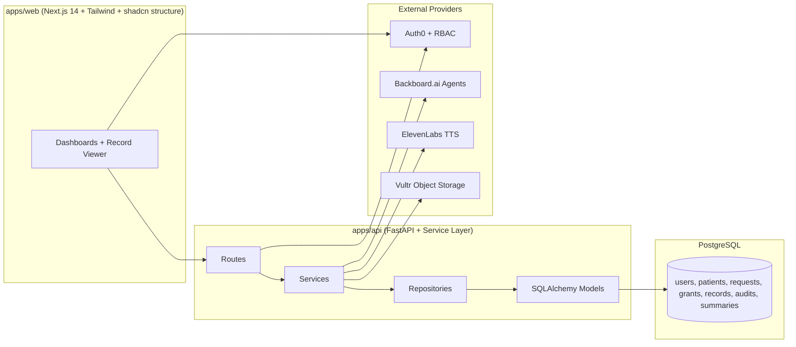

# HealthConnect Monorepo Starter

HealthConnect is a patient-controlled healthcare consent and access layer for the Canadian healthcare ecosystem.  
It does not replace hospital EHRs; it governs scoped, time-bound access to fragmented records with strong auditability.

## Project Overview

Core workflow:

1. Doctor authenticates with Auth0 and requests access.
2. Request includes categories, reason, and duration.
3. Patient or guardian approves/denies.
4. If approved, scoped access grant is issued.
5. Doctor can view only approved categories.
6. Access auto-expires and all events are audited.

Supported roles:

- `patient`
- `guardian`
- `doctor`
- `admin`

Supported record categories:

- `allergies`
- `medications`
- `labs`
- `imaging_reports`
- `referral_notes`
- `emergency_summary`

## Architecture Diagram



## Technology Stack

- Frontend: Next.js 14 App Router, TypeScript, TailwindCSS, shadcn/ui-style component layout
- Backend: FastAPI, Pydantic, SQLAlchemy, PostgreSQL
- Infra: Docker, Docker Compose, Vultr deployment placeholders, Vultr Object Storage integration points
- Networking: Tailscale private-network model with optional Tailscale Funnel demo exposure
- Auth: Auth0 + RBAC role model (`patient`, `guardian`, `doctor`, `admin`)
- AI: Backboard provider abstraction (`BackboardProvider`, `MockProvider`)
- Accessibility: ElevenLabs TTS abstraction (`ElevenLabsProvider`, `MockTTSProvider`)

## Monorepo Structure

```text
apps/
  web/                  # Next.js app (landing, dashboards, detail pages)
  api/                  # FastAPI app (routes/services/repositories/providers)

packages/
  ui/                   # Shared UI primitives
  types/                # Shared TypeScript domain types
  config/               # Shared env validation helpers

infra/
  docker-compose.yml
  env/*.env.example
  deployment/README.md  # Vultr + Tailscale deployment placeholders
```

## Backend Service Architecture

`apps/api/app` includes:

- `routes/`: HTTP boundaries and RBAC checks
- `services/`: consent logic, scope enforcement, summary generation, audit writes
- `repositories/`: DB persistence layer
- `schemas/`: Pydantic request/response models
- `models/`: SQLAlchemy tables
- `providers/`: Backboard, ElevenLabs, and storage abstractions

Implemented tables:

- `users`
- `roles`
- `patients`
- `guardians`
- `health_records`
- `record_metadata`
- `access_requests`
- `access_grants`
- `audit_logs`
- `summaries`

## Local Setup

### Option A: Docker Compose (recommended)

```bash
docker compose -f infra/docker-compose.yml up --build
```

Services:

- Web: `http://localhost:3000`
- API: `http://localhost:8000/api/v1`
- PostgreSQL: `localhost:5432`

### Option B: Run manually

1. Install root Node dependencies (shared package resolution):

```bash
npm install
```

2. Install web app dependencies:

```bash
npm install --prefix apps/web
```

3. Install Python dependencies:

```bash
pip install -r apps/api/requirements.txt
```

4. Seed demo data:

```bash
python -m app.scripts.seed
# run from apps/api
```

5. Start API:

```bash
uvicorn app.main:app --reload --host 0.0.0.0 --port 8000
# run from apps/api
```

6. Start web:

```bash
npm --prefix apps/web run dev
```

## Seed Data Included

Script: `apps/api/app/scripts/seed.py`

Users:

- 1 patient
- 1 guardian
- 1 doctor
- 1 admin

Records:

- allergy record
- medication list
- blood test
- referral note

## Testing

Backend tests in `apps/api/tests` include:

- access request creation
- consent approval
- scope enforcement
- access expiration logic

Run:

```bash
pytest apps/api/tests
```

## Environment Variables

Templates:

- `infra/env/api.env.example`
- `infra/env/web.env.example`
- `infra/env/db.env.example`
- `.env.example`

Key groups:

- Auth0: `AUTH0_DOMAIN`, `AUTH0_AUDIENCE`, `AUTH0_ISSUER`, `NEXT_PUBLIC_AUTH0_*`
- Backboard: `AI_PROVIDER`, `BACKBOARD_BASE_URL`, `BACKBOARD_API_KEY`
- ElevenLabs: `TTS_PROVIDER`, `ELEVENLABS_API_KEY`, `ELEVENLABS_VOICE_ID`
- Vultr Storage: `STORAGE_PROVIDER`, `VULTR_OBJECT_STORAGE_*`, `VULTR_BUCKET_NAME`, credentials
- DB: `DATABASE_URL`
- Tailscale: `TAILSCALE_AUTH_KEY` (deployment-level usage)

## Integration Points

### Auth0 + RBAC

- API auth dependency placeholder: `apps/api/app/api/deps.py`
- Replace header-based dev identity with JWT verification middleware.
- Enforce role claims for `patient`, `guardian`, `doctor`, `admin`.

### Vultr Object Storage

- Storage abstraction: `apps/api/app/providers/storage_provider.py`
- Use `VultrObjectStorageProvider` in production.
- Encryption calls are currently placeholders (`_encrypt_placeholder`, `_decrypt_placeholder`).

### Tailscale Networking

- Model documented in `infra/deployment/README.md`.
- Keep API and internal services on private tailnet.
- Optionally expose one demo endpoint via Tailscale Funnel.

### Backboard API

- Provider: `apps/api/app/providers/backboard_provider.py`
- Service usage: `apps/api/app/services/summary_service.py`
- Switch provider by setting `AI_PROVIDER=backboard`.

### ElevenLabs API

- Provider: `apps/api/app/providers/elevenlabs_provider.py`
- Service usage: `apps/api/app/services/summary_service.py`
- Switch provider by setting `TTS_PROVIDER=elevenlabs`.

## Roadmap

1. Replace startup `create_all` with Alembic migrations.
2. Add Auth0 JWT verification and claim-based authorization policies.
3. Add async job workers for Backboard and ElevenLabs processing.
4. Add signed URL streaming and secure encryption key management.
5. Implement full emergency break-glass policy and mandatory post-incident review.
6. Add accessibility enhancements, localization, and patient consent history diffing.
# HealthConnect
test
test 2 
